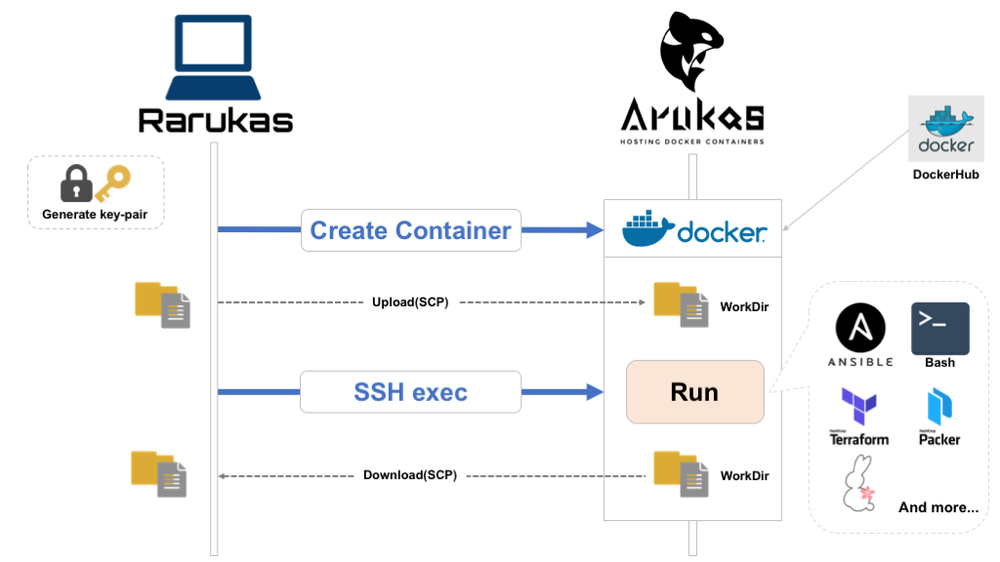

# rarukas (remote-arukas)

[](https://goreportcard.com/report/github.com/rarukas/rarukas)
[](https://travis-ci.org/rarukas/rarukas)

`rarukas` is CLI for running one-off command(s) on [Arukas](https://arukas.io).  



## About 


`rarukas` performs the following processes to execute one-off commands on Arukas.

- Generate key-pair for SSH public key authentication  
  (generate only when key-pair is not specified)
- Create containers with SSH server enabled on Arukas
- Upload local file(s) to container's workdir using SCP  
  (upload only when specified file(s))
- Connect to container by SSH and execute specified command
- Download container's workdir to local using SCP  
- Delete container

## Installation and Usage 

#### Prerequisites

Running `rarukas` needs Arukas API keys.  
You can generate them in [Arukas user control panel](https://app.arukas.io/settings/api-keys).   

## Installation

Download latest `rarukas` binary from [releases](https://github.com/rarukas/rarukas/releases/latest). And grant execute permission to `rarukas` like as `chmod +x rarukas`.

If you have golang develop environments, you can install using `go get`.

```bash
$ go get github.com/rarukas/rarukas
```

For convenience in running `rarukas`, you can export API Keys above as environment variables:

```bash
$ export ARUKAS_JSON_API_TOKEN=<your-api-token>
$ export ARUKAS_JSON_API_SECRET=<your-api-secret>
```


## Usage

To execute a single command, execute as follows:

```bash
$ rarukas curl -L https://arukas.io/en/
```

To execute command using single script file, execute as follows:

```bash
# script file
$ cat run-on-arukas.sh
#!/bin/bash

echo "running command on Arukas!"

# execute command using script file
$ rarukas -c run-on-arukas.sh
```

To execute command with synchronizing local files(directories), execute as follows:

```bash
# Directory to synchronize with container's workdir
$ tree work/
 work/
 └── run-on-container.sh

$ cat work/run-on-container.sh
!/bin/bash

echo "Running on container" > result.txt

###

# Execute command.
# Before executing command, "work" dir is uploaded to the container
# After executing command, download the container's workdir to local "work" dir

$ rarukas --sync-dir work "bash run-on-container.sh"

# Finally, files created on the container are downloaded in "work" directory
$ tree work/
tree work/
work/
├── result.txt  # Added
└── run-on-container.sh

```

### Options

```console
$ rarukas --help

  NAME:
     rarukas - CLI for running one-off commands on Arukas
  
  USAGE:
     rarukas [global options] command [command options] [arguments...]
  
  VERSION:
     0.0.1, build xxxxxx
  
  COMMANDS:
       help, h  Shows a list of commands or help for one command
  
GLOBAL OPTIONS:
   --token value                     API Token of Arukas (default: "") [$ARUKAS_JSON_API_TOKEN]
   --secret value                    API Secret of Arukas (default: "") [$ARUKAS_JSON_API_SECRET]
   --public-key value                Public key for SSH auth. If empty, generate temporary key [$RARUKAS_PUBLIC_KEY]
   --private-key value               Private key for SSH auth. If empty, generate temprary key [$RARUKAS_PRIVATE_KEY]
   --arukas-name value               Name of Arukas app (default: "rarukas-server") [$ARUKAS_NAME]
   --arukas-plan value               Plan of Arukas app [free/hobby/standard-1/standard-2] (default: "free") [$ARUKAS_PLAN]
   --image-type value, --type value  OS Type of Rarukas server base image [alpine/centos/ubuntu/ansible/sacloud] (default: "alpine") [$RARUKAS_IMAGE_TYPE]
   --image-name value                Name of Rarukas server base image. It must exist in DockerHub. Ignore image-type if it was specified [$RARUKAS_IMAGE_NAME]
   --command-file value, -c value    Script file to run on Arukas [$RARUKAS_COMMAND_FILE]
   --sync-dir value                  Directory to synchronize Arukas working directory [$RARUKAS_SYNC_DIR]
   --download-only                   Enable downloading only in synchronization with Arukas working directory (default: false) [$RARUKAS_DOWNLOAD_ONLY]
   --upload-only                     Enable uploading only in synchronization with Arukas working directory (default: false) [$RARUKAS_UPLOAD_ONLY]
   --boot-timeout value              Timeout duration when waiting for container be running (default: 10m0s) [$RARUKAS_BOOT_TIMEOUT]
   --exec-timeout value              Timeout duration when waiting for completion of command execution (default: 1h0m0s) [$RARUKAS_EXEC_TIMEOUT]
   --help, -h                        show help (default: false)
   --version, -v                     print the version (default: false)

COPYRIGHT:
   Copyright (C) 2018 Kazumichi Yamamoto.

```

## Advanced Usage

### Execute `ansible`

```bash
# prepare some files(inventory, keys, variables) for ansible
$ tree .
.
├── hosts    # inventory
└── test_key # private key 

# execute ansible
$ rarukas --type ansible --sync-dir . ansible all -i hosts -m ping
```

### Execute with [sacloud](https://github.com/sacloud) tools (ex. `usacloud`,`terraform`, and `packer`) 

#### usacloud

```bash
# execute usacloud(SAKURA Cloud CLI) 
$ rarukas --type sacloud usacloud --version
```

#### Terraform (with terraform-provider-sakuracloud)

```bash
$ cat run-terraform.sh

#/bin/bash
# set environment variable from .env file on current dir
source .env 

# run terraform command 
terraform init || terraform apply -auto-approve

$ rarukas --type sacloud --sync-dir . ./run-terraform.sh
```

#### Packer (with packer-builder-sakuracloud)

```bash
$ cat template.json

{
    "builders": [{
        "type": "sakuracloud",
        "zone": "is1b",
        "os_type": "centos",
        "password": "<put-your-password-here>",
        "disk_size": 20,
        "disk_plan": "ssd",
        "core" : 2,
        "memory_size": 4,
        "archive_name": "packer-example-centos",
        "archive_description": "description of archive"
    }],
    "provisioners":[
    {
        "type": "shell",
        "inline": [
            "echo foobar"
        ]
    }]
}

$ rarukas --type sacloud --sync-dir . packer build template.json
```

## Using customized Docker image

TODO

## License

 `rarukas` Copyright (C) 2018 Kazumichi Yamamoto.

  This project is published under [Apache 2.0 License](LICENSE.txt).
  
## Author

  * Kazumichi Yamamoto ([@yamamoto-febc](https://github.com/yamamoto-febc))